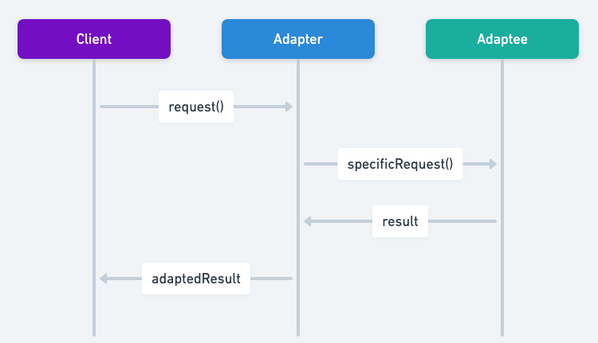
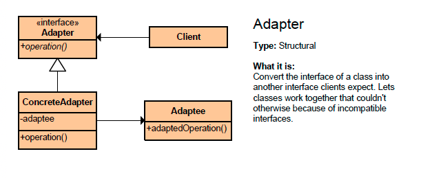

# Adapter Pattern

- It converts the interface of a class into another interface that clients expect, enabling compatibility.
- It lets you wrap an otherwise incompatible object in an adaptor to make compatible with another class.
- Adapter wraps one of the objects to hide the complexity of conversion happening behind the scenes.
- Wrapped object isn't even aware of the adapter.
- Adapter provides a completely different interface for accessing an existing object. On the other hand, with the Decorator pattern the interface either stays the same or gets extended.
- Bridge is usually designed up-front, letting you develop parts of an application independently of each other. On the other hand, Adapter is commonly used with an existing app to make some otherwise-incompatible classes work together nicely.
- With Adapter you access an existing object via different interface. With Proxy, the interface stays the same. With Decorator you access the object via an enhanced interface.

## Sequence diagram

## Class diagram

