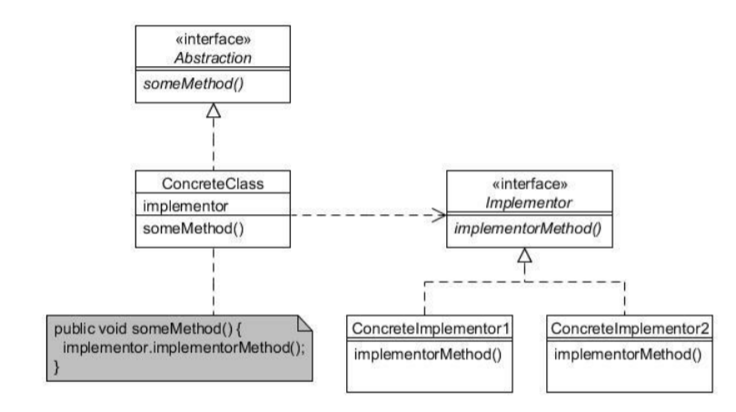

# Bridge pattern

- It decouples an abstraction from its implementation so that both can very independently
- It is about preferring composition to inhertance. Implementation details are pushed from a hierarchy to object with a separate hierarchy.

## Sequence diagram

## Class diagram

