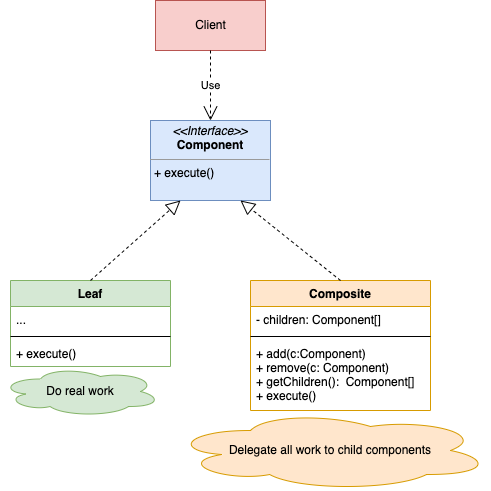

# Composite design pattern

- It lets you compose objects into tree structure and then work with these structures as if they were individual objects.
- Compose objects into tree structures to represent part-while hierarchies. It lets clients treat individual objects and compositions of objects uniformaly.
- Make sure that core model of app can be represented as a tree structure. Try to break it down into simple elements and containers. Remember that containers must be able to contain both simple elements and other containers.

