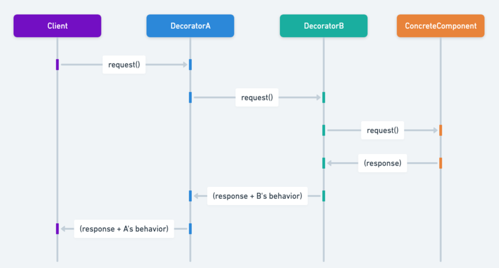
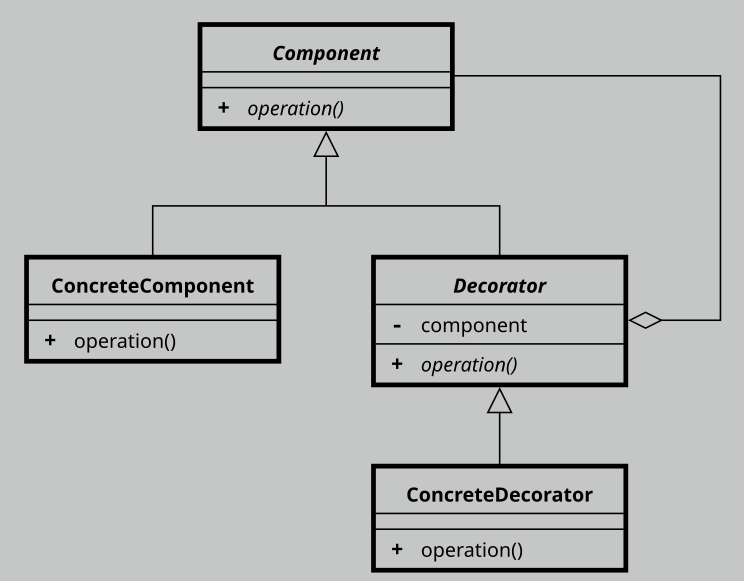

# Decorator pattern

- It lets you attach new behaviours to objects by placing these objects inside special wrapper objects that contain the behaviours. It is flexible alternative to subclassing.
- It allows for the dynamic addition of responsibilties to objects without modifying their existing code. It achieves this by providing a way to wrap objects within objects of similar interface.
- Adapter provides a completely different interface for accessing an existing object. On the other hand, with the Decorator pattern the interface either stays the same or gets extended.
- With Adapter you access an existing object via different interface. With Proxy, the interface stays the same. With Decorator you access the object via an enhanced interface.

## Sequence diagram

## Class diagram

