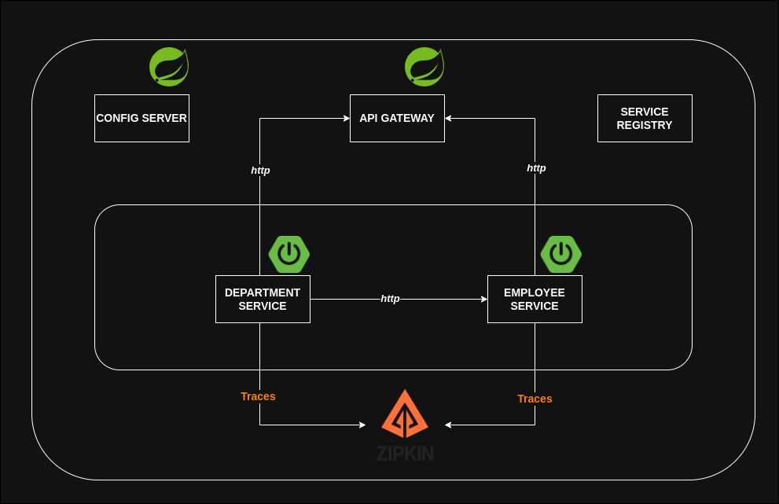

# Dept Employee Microservices



## Start zipkin server

```
docker run -d -p 9411:9411 openzipkin/zipkin

sudo nerdctl run -d -p 9411:9411 openzipkin/zipkin
```

## Curl commands

```shell
# list departments
curl http://localhost:8081/departments

# get department
curl http://localhost:8081/departments/1

# add new department
curl -d '{"id": 1, "name": "CS"}' -H 'Content-Type: application/json' http://localhost:8081/departments

# list employees
curl http://localhost:8082/employees

# get employee
curl http://localhost:8082/employees/1

# add new employee
curl -d '{"id": 1, "name": "Virat Kohli", "departmentId": 1, "position": "Head of Dept", "age": 35}' -H 'Content-Type: application/json' http://localhost:8082/employees
```

## References

[Microservices using SpringBoot 3.0 | Full Example [NEW] - Daily Code Buffer](https://www.youtube.com/watch?v=HFl2dzhVuUo)
